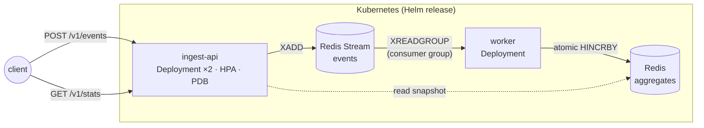

# k8s-event-pipeline

[](https://github.com/Sebjen0209/k8s-event-pipeline/actions/workflows/ci.yml)

A small but production-shaped event pipeline on Kubernetes: an HTTP ingest API
pushes events onto a Redis Stream, a consumer-group worker folds them into
aggregates, and everything ships Prometheus metrics.

**There is deliberately no live deployment.** CI builds the images, stands up
a real Kubernetes cluster ([kind](https://kind.sigs.k8s.io/)) inside the GitHub
Actions runner, deploys the Helm chart, and drives traffic through the full
pipeline — then throws the cluster away. The green badge above *is* the demo.
Running a 24/7 cluster to prove a point costs money and demonstrates nothing
extra; knowing that is part of the point.

## Architecture



- **ingest-api** (Go) — validates events, appends them to a capped Redis
  Stream, answers `202 Accepted` (queued, not yet aggregated), and serves the
  aggregate snapshot on `/v1/stats`. Liveness (`/healthz`), readiness
  (`/readyz`, checks Redis) and `/metrics` on every replica.
- **worker** (Go) — consumes the stream through a consumer group.
  **At-least-once**: a message is acked only after its aggregate update
  succeeded, and messages left pending by a crashed pod are reclaimed via
  `XAUTOCLAIM`. Consumer name = pod name (downward API), so `XPENDING` tells
  you exactly which pod died holding what.
- **redis** — single demo-grade instance (see trade-offs below).

## Try it locally

Requires Docker, kind, kubectl, helm.

```sh
make kind-up     # throwaway local cluster
make e2e         # build images, load, helm install, run the smoke test
make kind-down   # clean up
```

Or poke it by hand after `make e2e`:

```sh
kubectl port-forward svc/ingest-api 8080:80 &
curl -X POST localhost:8080/v1/events \
  -H 'Content-Type: application/json' \
  -d '{"type":"page_view","source":"curl","payload":{"path":"/"}}'
curl localhost:8080/v1/stats
```

## API

| Method | Path         | Description                                            |
|--------|--------------|--------------------------------------------------------|
| POST   | `/v1/events` | Enqueue an event → `202` + stream ID. `400` on invalid input (type/source: 1–64 chars of `[a-zA-Z0-9_.:-]`, payload ≤ 8 KiB, body ≤ 64 KiB). |
| GET    | `/v1/stats`  | Aggregate snapshot: total, counts by type and source, last event timestamp. |
| GET    | `/healthz` · `/readyz` · `/metrics` | Probes and Prometheus metrics.  |

## What the chart actually does

The Helm chart is where the Kubernetes craft lives:

- **Probes with different meanings** — liveness only checks the process;
  readiness also pings Redis, so a pod that lost its backend is pulled from
  the Service instead of being restarted for a problem it can't fix.
- **HPA** on the ingest API (CPU-based, 2–5 replicas) and a
  **PodDisruptionBudget** so a node drain can't take the API to zero.
- **Restricted security profile** — non-root, read-only root filesystem, all
  capabilities dropped, `RuntimeDefault` seccomp, distroless images (no shell
  in the container at all).
- **NetworkPolicy** — only ingest-api and worker may talk to Redis.
- **Graceful shutdown** — SIGTERM drains in-flight HTTP requests; the worker
  finishes its batch, and anything unacked is reclaimed by a peer.
- **Capped stream** — `XADD MAXLEN ~` so a stalled consumer can never grow
  Redis without bound.

## Design decisions

**Why Redis Streams and not Kafka/SQS?** The pattern being demonstrated —
producer / durable log / consumer group with acks and reclaim — is the same.
Kafka would add a three-node StatefulSet and operational weight that a
single-purpose pipeline doesn't need; SQS would tie the project to AWS and
kill the free, self-contained CI story. Right-sizing the infrastructure *is*
the decision.

**At-least-once, honestly.** Ack-after-write means a crash between the
aggregate update and the ack re-delivers the message, and plain counters would
double-count that redelivery. That's the correct trade-off for metrics-grade
data. If the counters were billing-grade, I'd store processed stream IDs
alongside the aggregates and make `Record` idempotent — noted in the code
where it would go.

**202, not 200.** Ingestion is durable enqueue, not synchronous processing.
The status code tells the client the truth about what has happened so far.

## Observability & day-2 operations

Deploying is day 1. This repo also ships the day-2 story:

- **Distributed tracing (OpenTelemetry)** — one trace follows an event from
  the HTTP request through the Redis Stream to the worker's aggregate write;
  the trace context rides inside the stream message, so the async hop doesn't
  break the trace. Off by default, on with one values flag
  (`tracing.otlpEndpoint`).
- **Metrics that answer pager questions** — RED metrics on the API (latency
  histogram by handler/code), and queue health computed *from Redis* at
  scrape time (`worker_stream_length`, `worker_stream_pending`,
  `worker_redis_up`) so the numbers survive worker restarts.
- **Alert rules as code** — [`rules/alerts.yaml`](deploy/chart/event-pipeline/rules/alerts.yaml)
  is promtool-validated in CI and shipped as a `PrometheusRule` by the chart.
  Every alert links a section in the [runbook](docs/runbook.md).
- **Grafana dashboard as code** — [`deploy/observability/grafana-dashboard.json`](deploy/observability/grafana-dashboard.json).
- **Load test with teeth** — CI runs [k6](hack/load.js) against the
  kind-deployed pipeline with hard thresholds (p95 < 300ms, <1% failures) and
  then verifies the backlog fully drains. The SLO is enforced, not aspirational.
- **A real postmortem** — I killed Redis under ~190 req/s of load and wrote up
  [what actually happened](docs/postmortems/001-redis-loss-under-load.md):
  8-second self-healing, honest data-loss accounting — and a genuine bug the
  experiment surfaced (worker error-looping on `NOGROUP` after Redis state
  loss), now fixed with a regression test.

## What I would change for production

| Demo choice                    | Production choice                                    |
|--------------------------------|------------------------------------------------------|
| Single Redis on `emptyDir`     | Managed Redis (ElastiCache) or Redis Sentinel + PVCs |
| CPU-based HPA                  | Scale the worker on consumer-group lag (KEDA)        |
| Plain-text stream              | TLS to Redis, AUTH from a Secret                     |
| Counters in Redis hashes       | Idempotent writes keyed by stream ID                 |
| kind + port-forward            | Managed cluster, Ingress + cert-manager              |

## Repository layout

```
cmd/ingest-api, cmd/worker    entrypoints (thin: wiring + shutdown)
internal/api                  HTTP handlers + validation
internal/worker               consumer-group loop (read → record → ack)
internal/stream, internal/stats  Redis access, one concern each
internal/telemetry            OpenTelemetry setup + trace propagation through the stream
deploy/chart/event-pipeline   Helm chart (incl. rules/alerts.yaml → PrometheusRule)
deploy/observability          Grafana dashboard JSON
docs/runbook.md               per-alert runbook
docs/postmortems/             chaos experiment write-ups
hack/smoke.sh, hack/load.js   e2e + k6 load test, used by `make` and CI
.github/workflows/ci.yml      lint · unit (race) · helm lint · promtool · kind e2e + load
```
